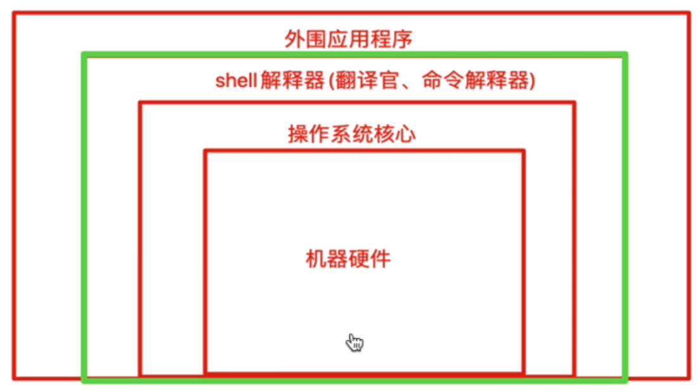

通过 sh 或  bash 可以在当前进程中开启新的shell进程，通过 exit 可退出


# shell的作用是

- 解释执行用户输入的命令或程序等

- 用户输入一条命令，shell就解释一条

- 键盘输入命令，Linux给予响应的方式，称之为交互式

  

# Shebang

计算机程序中，`shebang` 指的是出现在文本文件第一行前两个字符 `#！`

在Unix系统中，程序会分析 `shebang`后面的内容，作为解释器的指令，例如

- 以 `#！/bin/sh` 开头的文件，程序在执行时会调用`/bin/sh`，也就是bash解释器

- 以 `#！/usr/bin/python` 开头的文件，代表指定python解释器去执行
- 以 `#！/usr/bin/env` 解释器名称，是一种在不同平台上都能正确找到解释器的办法

注意事项：

- 如果脚本未指定 `shebang` ，脚本执行的时候，默认用当前shell去解释脚本，即 $SHELL
- 如果 `shebang` 指定了可执行的解释器，如 `/bin/bash` ，脚本在执行时，文件名会作为参数传递给解释器

# 脚本语言

shell脚本语言属于一种弱类型语言 `无需声明变量类型，直接定义使用`

`强类型语言，必须先定义变量类型，确定是数字、字符串等，之后再赋予同类型的值`

# shell变量

- 变量定义与赋值，注意变量与值之间不得有空格

  > 变量类型，bash默认把所有变量都认为是字符串

- 变量替换/引用

  > name=“HAI”
  >
  > echo ${name}
  >
  > echo $name     #可以省略花括号

- 变量名规则
  - 只能包含数字、字母、下划线
  - 不能以数字开头
  - 不能用标点符号
  - 变量名严格区分大小写

- 变量的作用域

  - 本地变量，只针对当前的shell进程

    > pstree  检查进程树

  - 环境变量，也称为全局变量，针对当前shell以及其任意子进程，环境变量也分 `自定义、内置` 两种环境变量
  - 局部变量，针对在 `shell`函数 或 `shell` 脚本中定义

- 位置参数变量：用于 `shell` 脚本中传递的参数    例如：ls -l /opt  中的 /opt

- 特殊变量：shell 内置的特殊功效变量

  - $?
    - 0：成功
    - 1-255：错误码

- 引号

  - 单引号变量，不识别特殊语法

  - 双引号变量，能识别特殊符号

  - 无引号
  
  - 反引号，引用命令执行结果，等于 $() 用法
  
    ```shell
    hzg@RedmiBook-Pro-15:~$ name="hu"
    hzg@RedmiBook-Pro-15:~$ echo $name
    hu
    hzg@RedmiBook-Pro-15:~$ name1='${name}'
    hzg@RedmiBook-Pro-15:~$ echo $name1
    ${name}
    hzg@RedmiBook-Pro-15:~$ name2="${name}"
    hzg@RedmiBook-Pro-15:~$ echo $name2
    hu
    ```

# 不同的执行方式，不同的shell环境

- 每次调用 bash 或 sh 都会开启一个子shell，因此不保留当前的shell变量
- 调用 source 或者 点 符号，在当前shell环境加载脚本，因此保留变量

```shell
hzg@RedmiBook-Pro-15:~$ cat make_name.sh 
name="大西瓜"
hzg@RedmiBook-Pro-15:~$ echo $name   

hzg@RedmiBook-Pro-15:~$ sh make_name.sh
hzg@RedmiBook-Pro-15:~$ echo $name          # 使用 sh 解释器执行脚本，是启动子shell去执行，完毕后回到父shell，无法保留变量

hzg@RedmiBook-Pro-15:~$ source make_name.sh      # source 或 点 的方法执行脚本，是在当前 shell 环境执行脚本，保留变量
hzg@RedmiBook-Pro-15:~$ echo $name
大西瓜

```


```shell
`linux命令`
在linux中反引号，中的命令执行结果会被保留下来
hzg@RedmiBook-Pro-15:~$ name=`ls`
hzg@RedmiBook-Pro-15:~$ echo $name
公共的 模板 视频 图片 未命名 1.ods 文档 下载 音乐 周.txt 桌面 doc programs projects snap tem.txt zhiban
```

# 环境变量设置

环境变量一般指的是用export内置命令导出的变量，用于定义shell的运行环境，保证shell命令的正确执行。

shell通过环境变量确定登陆的用户名、PATH路径、文件系统等各种应用。

环境变量可以在命令行中临时创建，但是用户退出shell终端，变量即丢失，如要永久生效，需要修改 `环境变量配置文件` 

- 用户个人配置在文件 `～/.bash_profile` 、 `～/.bashrc` ，读取时以个人的优先生效
- 全局配置文件 `/etc/profile` 、`/etc/bashrc` ，且系统建议最好创建在 `/etc/profile.d/` ，而非直接修改主文件，修改全局配置文件，影响所有登录系统的用户

## 检查系统环境变量的命令

- set，输出所有变量，包括全局变量、局部变量
- env，只显示全局变量
- declare，输出所有的变量，如同set
- export，显示和设置环境变量值

## 撤销环境变量

- unset 变量名，删除变量或函数

## 设置只读变量

- readonly，设置后不可修改，只有shell结束，只读变量失效

## 练习

如何通过export导出变量名

```shell
export | awk -F '[ :=]' '{print $3}'
```

## bash多命令执行

通过 分号 分隔多个命令

例如：ls  /data/;cd /tmp/

##  环境变量文件加载顺序


# 特殊参数变量

- $0        获取shell脚本文件名，以及脚本路径
- $n        获取shell脚本的第n个参数，n在1-9之间，如$1, $2，大于9则需要写 ${10}。参数空格隔开
- $#        获取执行的shell脚本后面的参数总个数
- $*         获取shell脚本所有参数，不加引号的等同于$@作用，加上引号 "$*" 作用是 接收所有参数为单个字符串， "$1 $2 ..."
- $@         不加引号，效果同上，加引号，是接收所有参数为独立字符串，如 "$!" "$2" ......，空格保留
- $* 和 $@的区别
  - $* 和 $@ 都表示了传递给函数或脚本的所有参数
  - 当 $* 和 $@ 不被双引号“ ” 包围时，没有区别，都是将接收的每个参数看做一份数据，彼此之间用空格分隔
  - 使用“ ”时就有区别，通过echo无法看出来，通过 for 循环来逐个输出就可以看出区别

```shell
ls -l 参数

test1.sh

# 参数的理解
bash test1.sh 参数1 参数2 参数3

位置参数的获取
$0 获取文件名
$1 获取第一个参数
......
```

# 特殊状态变量

- $?            上一次命令执行状态返回值，0 正确，非0 失败
- $$            当前shell脚本的进程号

- $!              上一次后台进程的PID（通过nohup命令执行的进程）
- $_              在此之前执行的命令，最后一个参数

通过  `man bash`，然后搜索  `Special Parameters`  可查看所有特殊参数

```shell
hzg@RedmiBook-Pro-15:~$ cat test.sh 
#!/bin/bash
# $#获取参数个数 -ne 不等于的情况 && 并且

[ $# -ne 2 ] && {
	echo "must be two args"
	exit 119    #终止程序运行，且返回119状态，提供给当前shell的$?变量，若是在函数里 可以return 119用法
}
echo "没毛病，就是2个参数"
hzg@RedmiBook-Pro-15:~$ 
hzg@RedmiBook-Pro-15:~$ sh test.sh 1 2 3
must be two args
hzg@RedmiBook-Pro-15:~$ echo $?
119
hzg@RedmiBook-Pro-15:~$ sh test.sh 1 2
没毛病，就是2个参数
hzg@RedmiBook-Pro-15:~$ echo $?
0
```

# bash一些基础内置命令

- echo

  - -n     不换行输出
  - -e      解析字符串中的特殊符号
  - \n      换行
  - \r       回车
  - \t       制表符   四个空格
  - \b      退格

  ```shell
  #不换行打印
  hzg@RedmiBook-Pro-15:~$ echo xuxu; echo chichi
  xuxu
  chichi
  hzg@RedmiBook-Pro-15:~$ echo -n xuxu;echo chichi
  xuxuchichi
  hzg@RedmiBook-Pro-15:~$ echo -n xuxu;echo -n chichi
  xuxuchichihzg@RedmiBook-Pro-15:~$
  
  #解析特殊符号
  hzg@RedmiBook-Pro-15:~$ echo "xuxu\nchichi"
  xuxu\nchichi
  hzg@RedmiBook-Pro-15:~$ echo -e "xuxu\nchichi"
  xuxu
  chichi
  ```

- eval      执行多个命令

```shell
hzg@RedmiBook-Pro-15:~$ eval ls;cd /tmp
 公共的   视频  '未命名 1.ods'   下载   周.txt   doc        projects   tem.txt
 模板     图片   文档            音乐   桌面     programs   snap       zhiban
hzg@RedmiBook-Pro-15:/tmp$
```

- exec      不创建子进程，执行后续命令，且执行完毕后，自动exit

```shell
hzg@RedmiBook-Pro-15:~$ sudo -i
root@RedmiBook-Pro-15:~# exec date
2022年 12月 13日 星期二 21:20:39 CST
hzg@RedmiBook-Pro-15:~$
```

# shell子串

```shell
${变量}                       返回变量值
${#变量}                      返回变量长度，字符长度
${变量:start}                 返回变量start数值之后的字符, 例：${变量:4}
${变量:start:length}          提取start之后的length限制的字符
${变量#word}                  从变量开头删除最短匹配的word子串
${变量##word}                 从变量开头，删除最长匹配的word
${变量%word}                  从变量结尾删除最短的word
${变量%%word}                 从变量结尾开始删除最长匹配的word
${变量/pattern/string}        用string代替第一个匹配的pattern
${变量//pattern/string}       用string代替所有的pattern


#实际案例
hzg@RedmiBook-Pro-15:~$ name="yuchao180"
hzg@RedmiBook-Pro-15:~$ echo $name
yuchao180
hzg@RedmiBook-Pro-15:~$ echo ${name}
yuchao180
hzg@RedmiBook-Pro-15:~$ echo ${#name}
9
hzg@RedmiBook-Pro-15:~$ echo ${name:3}
hao180
hzg@RedmiBook-Pro-15:~$ echo ${name:2:4}
chao
```

## 计算长度

```shell
# wc命令
cat $name | wc -L

# 利用数值计算expr命令
expr length "${name}"

# awk 统计长度，length函数
echo "${name}" | awk `{print length($0)}`

# 最快的统计方式
echo ${#name}
```

> shell中的for 循环
>
> 语法：
>
> for  变量  in {1..100}
>
> do
>
> ​		echo $变量
>
> done
>
> 一行的写法：
>
> for  变量  in {1..100}；do  echo $变量；done

```shell
#time 计算时长
time for n in {1..10000};do char=`seq -s "chao" 100`;echo ${#char} &>/dev/null;done

real	0m6.715s       #实际时间
user	0m5.179s       #用户态时间
sys	0m1.843s           #内核态时间
```

## 字符串截取

```shell
#从头匹配
hzg@RedmiBook-Pro-15:~$ echo $name
abcABC123ABCabc
hzg@RedmiBook-Pro-15:~$ echo ${name#a*c}
ABC123ABCabc
hzg@RedmiBook-Pro-15:~$ echo $name
abcABC123ABCabc
hzg@RedmiBook-Pro-15:~$ echo ${name##a*c}

hzg@RedmiBook-Pro-15:~$
#从结尾开始匹配
hzg@RedmiBook-Pro-15:~$ echo $name
abcABC123ABCabc
hzg@RedmiBook-Pro-15:~$ echo ${name%a*c}
abcABC123ABC
hzg@RedmiBook-Pro-15:~$ echo ${name%%a*c}

hzg@RedmiBook-Pro-15:~$ echo ${name%%a*C}
abcABC123ABCabc
```

# 删除文件名案例

数据源

```shell
hzg@RedmiBook-Pro-15:~/sub_test$ touch chaochao_{1..5}_finished.jpg
hzg@RedmiBook-Pro-15:~/sub_test$ ls -l
总用量 0
-rw-rw-r-- 1 hzg hzg 0 12月 13 22:43 chaochao_1_finished.jpg
-rw-rw-r-- 1 hzg hzg 0 12月 13 22:43 chaochao_2_finished.jpg
-rw-rw-r-- 1 hzg hzg 0 12月 13 22:43 chaochao_3_finished.jpg
-rw-rw-r-- 1 hzg hzg 0 12月 13 22:43 chaochao_4_finished.jpg
-rw-rw-r-- 1 hzg hzg 0 12月 13 22:43 chaochao_5_finished.jpg
hzg@RedmiBook-Pro-15:~/sub_test$ touch chaochao_{1..5}_finished.png
hzg@RedmiBook-Pro-15:~/sub_test$ ls -l
总用量 0
-rw-rw-r-- 1 hzg hzg 0 12月 13 22:43 chaochao_1_finished.jpg
-rw-rw-r-- 1 hzg hzg 0 12月 13 22:44 chaochao_1_finished.png
-rw-rw-r-- 1 hzg hzg 0 12月 13 22:43 chaochao_2_finished.jpg
-rw-rw-r-- 1 hzg hzg 0 12月 13 22:44 chaochao_2_finished.png
-rw-rw-r-- 1 hzg hzg 0 12月 13 22:43 chaochao_3_finished.jpg
-rw-rw-r-- 1 hzg hzg 0 12月 13 22:44 chaochao_3_finished.png
-rw-rw-r-- 1 hzg hzg 0 12月 13 22:43 chaochao_4_finished.jpg
-rw-rw-r-- 1 hzg hzg 0 12月 13 22:44 chaochao_4_finished.png
-rw-rw-r-- 1 hzg hzg 0 12月 13 22:43 chaochao_5_finished.jpg
-rw-rw-r-- 1 hzg hzg 0 12月 13 22:44 chaochao_5_finished.png
```

去掉所有文件的 _finished 字符信息

```shell
#批量文件名替换，只修改所有的jpg文件
for file_name in `ls *fin*jpg`;do mv ${file_name} ${file_name//_finished/};done
或者
for file_name in `ls *fin*jpg`;do mv ${file_name} `echo ${file_name//_finished/}`;done
```

# 特殊shell扩展变量

对变量的值进行判断、处理

```shell
#如果parameter变量为空，返回word字符串
${parameter:-word}
#如果para变量为空，则word替代变量值，且返回其值
${para:=word}
#如果para变量为空，word当作stderr输出，否则输出变量值用于设置变量为空导致错误时，返回的错误信息
${para:?word}
#如果para变量为空，什么都不做，否则word返回
${para:+word}
```

